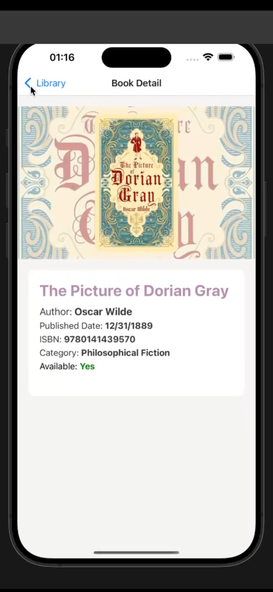
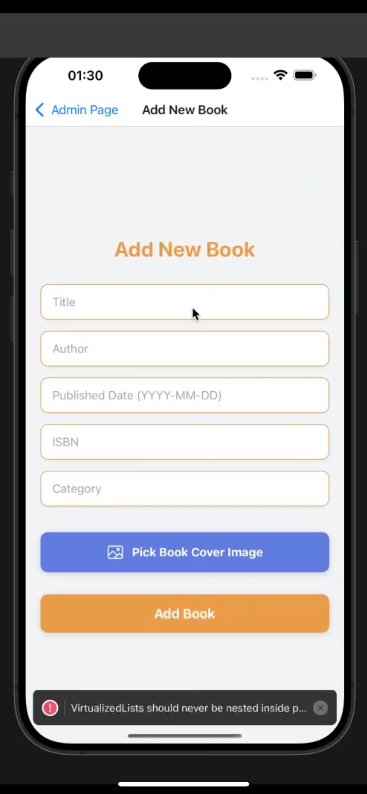

# Book Management App - React Native

This is a **Book Management App** developed using **React Native**. The application allows users to manage a collection of books by adding, viewing, and updating information about the books. It also supports features like uploading a book cover image and navigating through different pages.

## Screenshots

### Home Page & Sign Up Page

  
  

### Book Detail Page & Book List Page

  
  

### Admin Page & Add Book Page 

  
    

